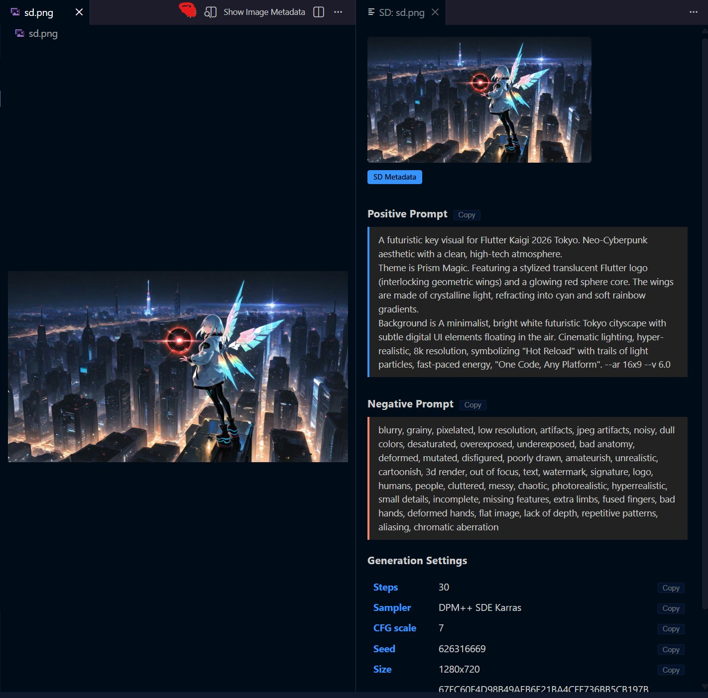

English version: [README.md](README.md)

# Image Metadata Viewer

画像ファイルのメタデータ（Stable Diffusion / ComfyUI / EXIF）をサイドパネルに表示する Visual Studio Code 拡張機能です。

## 特徴

- **Stable Diffusion メタデータ**表示（A1111 形式）— PNG ファイル対応
- **ComfyUI ノードグラフ**メタデータ表示 — PNG ファイル対応
- **EXIF データ**のカテゴリ別表示 — JPEG ファイル対応
- **サムネイルプレビュー**をメタデータパネル内に表示
- **コピーボタン**でプロンプト・設定値・生データをワンクリックコピー
- **アクティブタブ自動連動** — エディタのタブ切り替えに追従
- **Nonce ベースの Content Security Policy** による Webview セキュリティ
- **VS Code テーマ統合** — ネイティブテーマ変数を使用

## スクリーンショット



## インストール

### VSIX からインストール

1. [Releases](../../releases) ページから `.vsix` ファイルをダウンロードします。
2. VS Code でコマンドパレットを開きます（`Ctrl+Shift+P`）。
3. **Extensions: Install from VSIX...** を実行し、ダウンロードしたファイルを選択します。

### ソースからビルド

```bash
git clone https://github.com/granoeste/image-metadata-viewer.git
cd image-metadata-viewer
npm install
npm run compile
npm run package
```

生成された `.vsix` ファイルを上記の手順でインストールしてください。

## 使い方

メタデータを表示するには 3 つの方法があります。

- **右クリックコンテキストメニュー**: エクスプローラーで画像ファイルを右クリックし、**Show Image Metadata** を選択します。
- **エディタタイトルボタン**: 画像ファイルを開き、エディタタイトルバーのメタデータボタンをクリックします。
- **自動連動**: メタデータパネルが開いている状態でタブを切り替えると、自動的に表示内容が更新されます。

## 対応フォーマット

### PNG — Stable Diffusion（A1111）

PNG の tEXt チャンクから `parameters` キーを読み取り、A1111 形式としてパースします。

| セクション | 内容 |
|-----------|------|
| Positive Prompt | プロンプト全文（コピーボタン付き） |
| Negative Prompt | ネガティブプロンプト全文（コピーボタン付き） |
| Generation Settings | キー・値テーブル（Steps, Sampler, CFG Scale, Seed, Size, Model 等）行ごとのコピー対応 |
| Raw Metadata | 折りたたみ式の生テキスト（コピーボタン付き） |

### PNG — ComfyUI

PNG の tEXt チャンクから `prompt` / `workflow` キーを読み取り、ノードグラフ情報を抽出します。

| セクション | 内容 |
|-----------|------|
| Positive Prompt | ノードグラフから抽出 |
| Negative Prompt | ノードグラフから抽出 |
| Generation Settings | 抽出されたパラメータテーブル |
| Raw Prompt JSON | 折りたたみ式 JSON（コピーボタン付き） |
| Raw Workflow JSON | 折りたたみ式 JSON（コピーボタン付き） |

### JPEG — EXIF

JPEG ファイルの APP1 セグメントから TIFF/IFD 構造を解析します。

| カテゴリ | 表示例 |
|---------|--------|
| Camera | メーカー、モデル、ソフトウェア |
| Shooting | 露出時間、絞り値（F値）、ISO 感度、焦点距離 |
| Image | 幅、高さ、向き、色空間 |
| GPS | 緯度、経度、高度 |
| Other | その他の EXIF タグ |

## 動作要件

- VS Code 1.85.0 以上

## ライセンス

MIT
